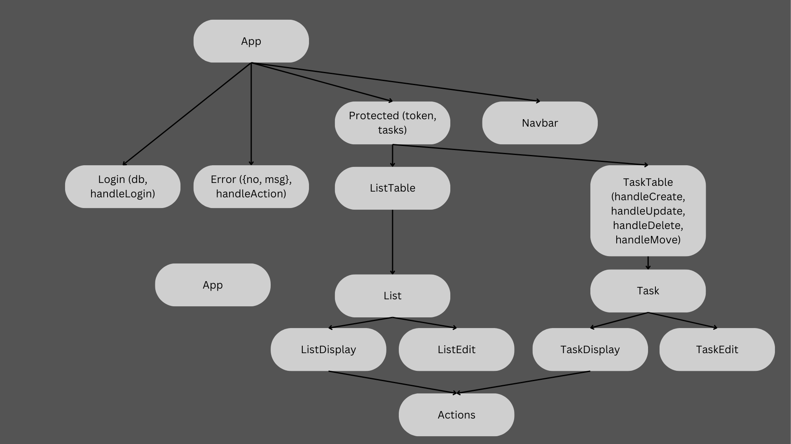

# Product Backlog React UI

`coder-ratz` | Ralf Tischer, 2023-2024.

Javascript React user interface to work with simplified product backlogs. 

<!-- MD-TOC START LEVEL 2 -->

## Table of Contents

- [Links](#links)
- [Technical Background](#technical-background)
  - [React Components](#react-components)
- [Available Scripts](#available-scripts)
  - [`npm start`](#`npm-start`)
  - [`npm test`](#`npm-test`)
  - [`npm run deploy`](#`npm-run-deploy`)
  - [`npm run build`](#`npm-run-build`)
  - [`npm run eject`](#`npm-run-eject`)
- [Author](#author)

<!-- MD-TOC END -->

# Links

* Product Backlog UI on GitHub Pages: [https://coder-ratz.github.io/product-backlog-react-ui/](https://coder-ratz.github.io/product-backlog-react-ui/)
* Product Backlog Backend GitHub (private) repository: [https://github.com/coder-ratz/product-backlog-flask-api](https://github.com/coder-ratz/product-backlog-flask-api)

# Technical Background

The React app acts as user interface (UI) to allow user interaction with an API. This backend manages the full communication with the external database. 

To access the data, a login with username and password is required. If the login at the API try successful, a JWT token is returned, stored and sent at each API request. 

After login, the user chooses between different lists assigned to her or his name. Existing lists can be edited and new can be created. 

Exchange list consist tasks with simple properties which can be edited. 

## React Components



# Available Scripts

In the project directory, you can run:

## `npm start`

Runs the app in the development mode.\
Open [http://localhost:3000](http://localhost:3000) to view it in your browser.

The page will reload when you make changes.\
You may also see any lint errors in the console.

## `npm test`

Launches the test runner in the interactive watch mode.\
See the section about [running tests](https://facebook.github.io/create-react-app/docs/running-tests) for more information.

## `npm run deploy`

Deploy project tp GitHub Pages to the `gh-pages` branch of this repository.

 ```bash
 $ npm run deploy -- -m "Deploy React app to GitHub Pages"
 ```

## `npm run build`

Builds the app for production to the `build` folder.\
It correctly bundles React in production mode and optimizes the build for the best performance.

The build is minified and the filenames include the hashes.\
Your app is ready to be deployed!

See the section about [deployment](https://facebook.github.io/create-react-app/docs/deployment) for more information.

## `npm run eject`

**Note: this is a one-way operation. Once you `eject`, you can't go back!**

If you aren't satisfied with the build tool and configuration choices, you can `eject` at any time. This command will remove the single build dependency from your project.

# Author
`coder-ratz` | Ralf Tischer, 
2023-2024
